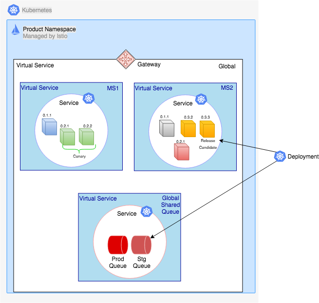
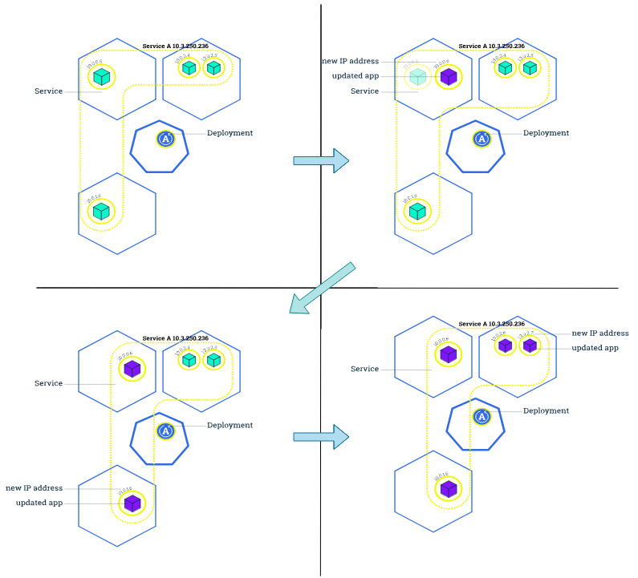

[home](../README.md)
# [Continous Delivery](README.md) - Deployment Process

**Version Deployment Patterns**
When deploying artefacts in the ecosystem we can find the following patterns:

**Unique Version pattern**

The last version deployed will override the previous version and the end state will only allow a version of the microservice at one point of time.

In this pattern, when performing non-production deployments there will be no coexistence and the last version will override the previous version before performing the relevant tests. If there is a failure, fast feedback will be done via the CD process and the team will need to apply a fast-forward fix on the non-prod environment until the failure is fix producing a release candidate that will be ready to be deployed in production.

When performing production deployments, there is some room for temporary coexistence of versions in this pattern while performing a Blue/ Green or Canary deployment, but once the relevant tests and assessments have been performed if the last version deployed is successful it will override the previous one using a rolling update mechanism. If the last deployed version is not successful, we roll back to the previous version.

**Coexisting Versions pattern**

Versions of a microservice can coexist at a given point of time. Using traffic shaping techniques, the different types of traffic (production, e2e-test, component-test) can be directed to the right versions of the microservice. This is the preferred pattern.

Example utilising Kubernetes:

Standard Rules:

1. Major.Minor versions can coexist at any given point of time. Three versions which difference is on the Major.Minor semantic they can coexist (i.e. 0.1.1, 0.2.1, 0.3.2)
1. Only two versions of Major.Minor.Revision can coexist at any given point of time, while testing or while doing a canary deployment (i.e. 0.1.1 and 0.1.2 is valid while 0.1.1, 0.1.2 and 0.1.3 is invalid)
1. E2E-Test traffic will be differentiated from other type of traffic with an e2e-test header.
1. Component-Test traffic will be differentiated from other type of traffic with a component-test header.
1. It is recommended in consumer-producer patterns with queues to store the microservice version of the producer, as it can be used down the line for ecosystem analytics.
1. A/B traffic or multiuser-base ecosystems can be shaped and directed by a header that mimics a condition. In some cases, it might be accordingly coded in the code-base.

**Rolling Update Mechanism**

Rolling updates allow the following actions:

* Promote an application from one environment to another (via container image updates)
* Rollback to previous versions
* Continuous Integration and Continuous Delivery of applications with zero downtime

