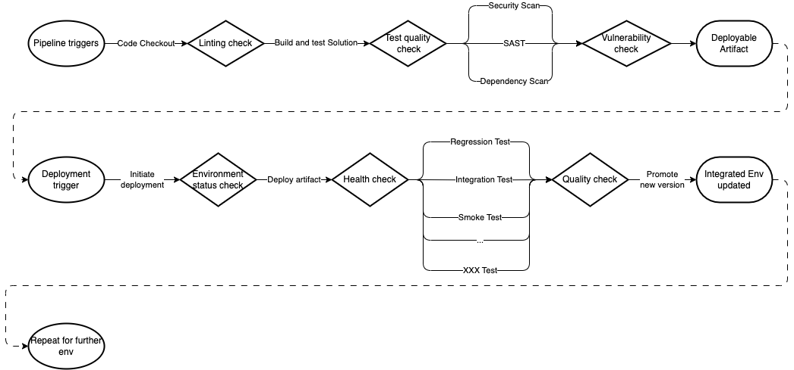

[home](../README.md)
# [Continous Delivery](README.md) - Quality Gate Enforcement

A quality gate is an enforced measure built into your pipeline that the software needs to meet before it can proceed to the next step. This measure enforces certain rules and best practices that the code needs to adhere to prevent poor quality from creeping into the code.

Quality gates are typically automated, allowing the pipeline to self-monitor the quality of delivered code.

Example of a pipeline with gates at every step:

Some of the example gates from above:

* **Linting**: Check that all code that is written is compliant with the standards within the organisation. This means for example that variables should follow PascalCase or camelCase, there should be a white line when opening an if statement etc. It ensures that developers have a standard way of working, allowing developers to pick up and review each other’s work without having to go through a lot of effort trying to understand the code.
* **Test quality check**: Making sure that there are no unit test failures, the code coverage of the entire solution as well as newly introduced code is above the minimum specification (e.g. >80% coverage required), as well as making sure the technical debt/duplicated lines are not getting out of hand.
* **Vulnerability check**: A CI/CD pipeline should have security scanning in place, this ensures that the newly developed code is not introducing know security vulnerabilities, is using compromised libraries etc.
* **Environment status check**: Before proceeding to deploy a new artifact, a check is put in place that the current environment is behaving as expected or that there isn’t another deployment in progress that could impact the success of the artifact that we are about to deploy.
* **Health check**: An application/component should have a well-developed health endpoint that is retrievable from an automation point of view to confirm that the newly introduced artifact is behaving as expected from a startup perspective. Typical checks on the endpoint are things like is database reachable from within the application, is the API profile loaded correctly, etc…
* **Quality check**: This is a check for all the various test automation suites you would run against a deployed application to give a high degree of confidence that the application is operating as expected.