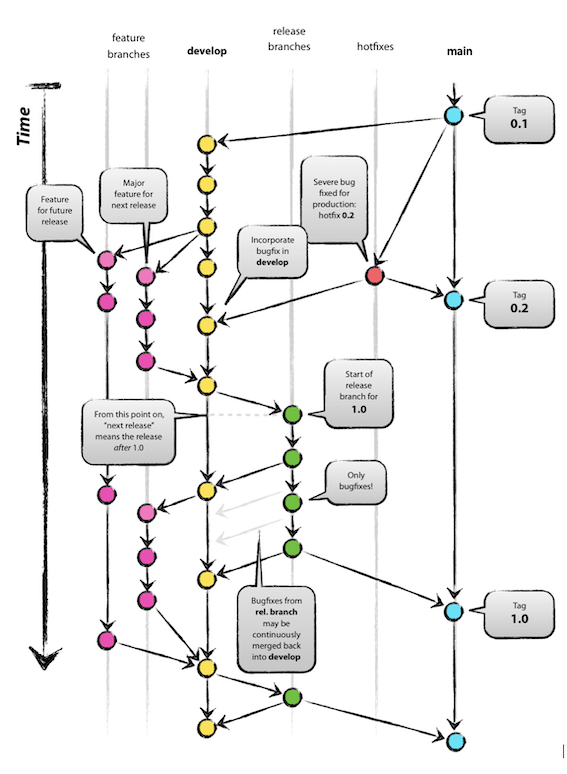

[home](../README.md)
# [Development Practices](README.md) - Branching Strategy

Having a well defined branching strategy is crucial to enable the team to collaborate effectively.

There are multiple branching strategies that the team could adopt (see below) but, as with everything, this needs to be agreed and followed.

There is no "one size fits all" branch strategy. Some approaches better suit small teams with shorter delivery cycles, others are more suited to defined release windows etc.
One thing that should always be kept in mind when choosing a strategy is that the longer changes are kept separate, the harder they are to integrate together.

Regardless of the branching strategy selected, effective use of tagging is highly recommended. e.g. tagging build points that were deployed to production.

**Gitflow**

A widely used branching strategy where the **main** branch always reflects current production.

Although not always, Gitflow is commonly used in larger/mature applications.

In this approach:
* **main**: protected branch that reflects current production
* **develop**: always at or ahead of **main**, containing changes that the team are planning to include in the next release
* **feature**: branched off **develop** and contains the changes for a single feature (should be kept up to date with **develop**)
* **release**: a combination of changes to be tested and released together
* **hotfix**: branched off **main** in order to just fix an issue in production

The major weakness of this approach is the tendancy to have long lived feature branches. This leads to an increased likelihood of merge conflicts
Additionally, without proper checks, there is a risk that a release branch is missing a hotfix that had been deployed to production - effectively reintroducing the bug.

**Trunk-based Development**

Trunk-based development is a branching strategy where developers work on the same branch ("trunk"). It is rare that developers would create separate branches, but when required, branches are very short-lived (<1 day).

The power of trunk-based development is that fits very well with [CI/CD](../continuous-delivery/README.md). Every commit to the trunk results in a build which (so long as it passes all the checks) could be released.

As a consequence of the developers working on the same branch, commits need to be small and frequent. The team need to be fully engaged with the notion that their changes need to be fit for others to integrate straight away.

Although trunk-based development doesn't eliminate code conflicts, frequent merges allow conflicts to be identified and addressed quickly.

**Feature Branching**

Feature Branch workflow has **main** as a protected branch. All change is made to a suitably named feature branch.

Once the feature has been developed, a pull request is created to trigger a code review before the feature can be merged into **main**.

**Further reading**:

* [A successful Git branching model](https://nvie.com/posts/a-successful-git-branching-model/)
* [Introducing GitFlow](https://datasift.github.io/gitflow/IntroducingGitFlow.html)
* [Gitflow workflow](https://www.atlassian.com/git/tutorials/comparing-workflows/gitflow-workflow)
* [Feature branch workflow](https://www.atlassian.com/git/tutorials/comparing-workflows/feature-branch-workflow)
