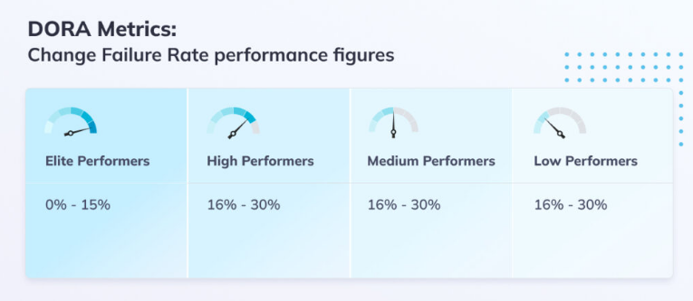

[home](../README.md)
# [Metrics](README.md) - Change Fail Percentage

Change failure rate represents the percentage of releases that result in some type of failure. We want to reduce this rate of faulty deployments as much as possible, as each such cycle of deployment and then remediation via rollback or a fix is very time-consuming and can also impact the level of service that our users experience.

**Best practices to decrease Change Failure Rate**

You can decrease Change Failure Rate by setting automated testing that runs with a certain frequency and doesn’t skip steps that manual testing could. This way, potential issues can be identified and managed faster before they are released to production. Measuring Change Failure Rate means measuring code quality, and this is a crucial point to cover when it comes to DevOps teams’ performance.

