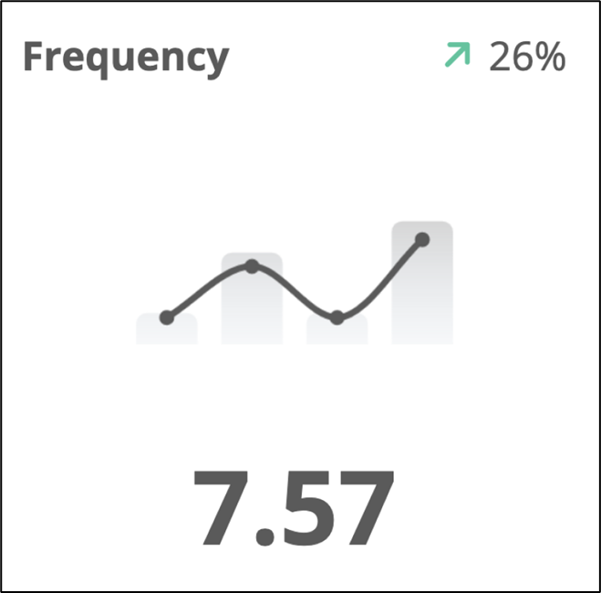
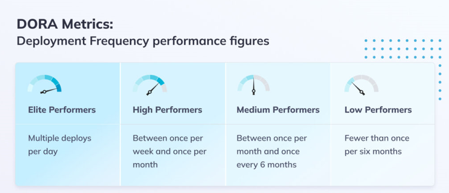

[home](../README.md)
# [Metrics](README.md) - Deployment Frequency

Deployment frequency represents the number of production deployments that are deployed within an interval of time

 
**Best practices to increase Deployment Frequency**

* Reduce deployment size by breaking up work pieces into smaller batches, as these will take less time to deliver, and they will be more manageable in case of issues occur. 
* Use release trains for larger bodies of work and batch together multiple changes. 
* Set attainable objectives regarding how many deployments per day/ week you want your teams to deliver to production, taking into account the particularities of your project and team members’ capabilities. 
* Use automated CI/CD pipelines to test, deploy, and subsequently monitor changes faster and more efficiently.

