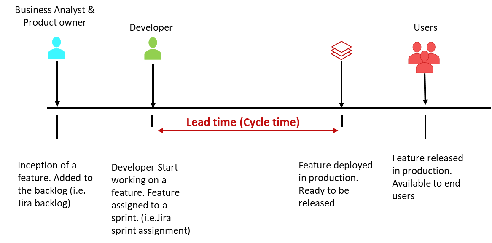
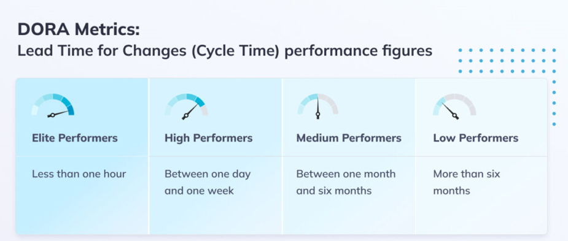

[home](../README.md)
# [Metrics](README.md) - Lead Time

Lead time, sometimes also called Cycle Time, measures the amount of time it takes a commit to get into production. This includes everything from the first commit to deployment, with all the testing, build, and CI/CD pipeline on the way.

**Best practices to improve Lead Time**

* Organize work pieces in small batches – this way, and it’s easier to identify bottlenecks and fix issues faster when they are triggered.
* Use automated testing to identify issues with code before it goes into production.
* Use CI to automate deployment pipeline

