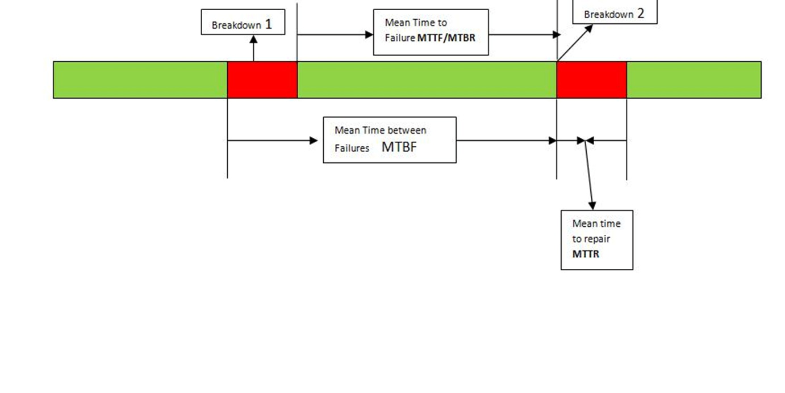
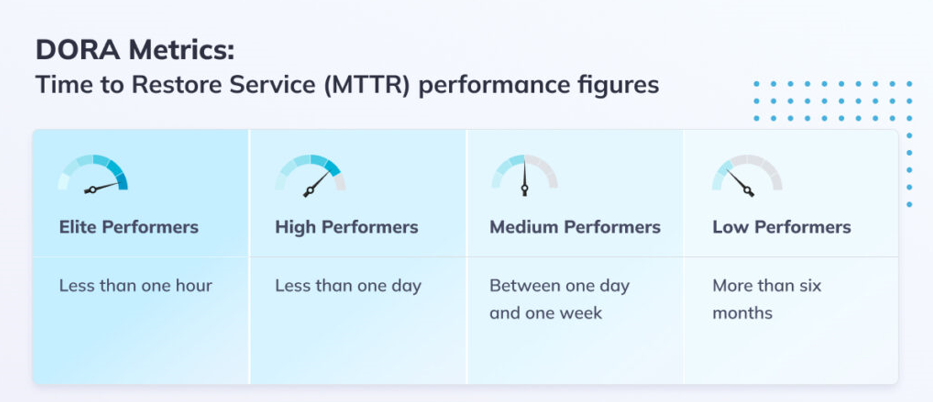

[home](../README.md)
# [Metrics](README.md) - Mean Time to Restore

MTTR is the time from a failure to recovery from that failure in production.

**Best practices to improve MTTR**

Implement reliable monitoring tools to detect issues in real-time.

Develop a pre-established quick-response action plan can further minimise downtime and is a best practice for high-performing DevOps teams.

