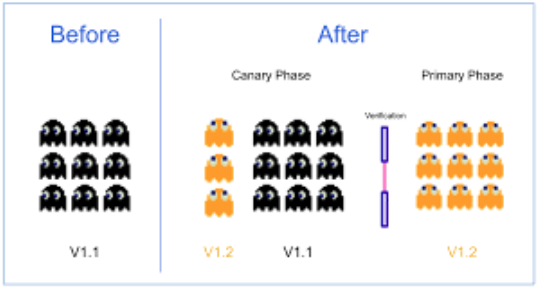

[home](../README.md)
# [Release Management](README.md) - Release Techniques

There are a number of different release techniques that can be associated with DevOps best practices, some techniques include:

* Blue/Green Deployments
* Canary Releases
* Rolling Deployments
* A/B Testing

## Blue/Green Deployments

A Blue-Green Deployment is a release management technique that involves maintaining two identical environments, often referred to as "Blue" and "Green." This approach allows for the seamless deployment of new software releases or updates with minimal disruption and the ability to quickly revert to the previous version if issues arise.

In this deployment technique the Blue Environment represents the current production system, which is stable and in use by your users and the Green Environment is an identical clone of the production system, but it remains inactive. It's where you deploy the new release and perform testing before switching to it.

To deploy a new software version, the following high level steps are taken:

1. **Deployment to Green**: When a new release is ready, it's deployed to the Green environment. This deployment is performed in isolation, away from the eyes of end-users.
1. **Testing in Green**: Extensive testing is conducted in the Green environment to ensure that the new release functions correctly, performs well, and doesn't introduce any unexpected issues.
1. **Approval and Verification**: After successful testing and verification, the new release is marked as ready for production. This is often done via automated testing and approval workflows.
1. **Switch Traffic**: Once the new release in the Green environment is approved, you switch the production traffic from the Blue environment to the Green environment. Users are now interacting with the new release.

If there is any problem with the new software version, traffic can be switched back to the blue environment with minimal downtime. 

Advantages of Blue/Green deployments include:

* **Zero Downtime**: The Blue-Green Deployment approach minimizes or eliminates downtime during the release, as the transition is seamless.
* **Rapid Rollback**: If issues are detected in the Green environment after the switch, you can quickly revert to the stable Blue environment to minimize user disruption.
* **Testing and Verification**: The technique allows for thorough testing and verification in a production-like environment, reducing the likelihood of post-release issues.
* **Predictable Rollouts**: It provides a predictable and reliable method for rolling out changes, ensuring a consistent user experience.
* **Enhanced Reliability**: The ability to switch back to the previous version swiftly enhances system reliability and minimizes risks. 

## Canary Release
A canary release is a deployment strategy that releases an application or service incrementally to a subset of users. All infrastructure in a target environment is updated in small phases (e.g: 2%, 25%, 75%, 100%). This group is often chosen based on factors such as their willingness to participate, specific user profiles, or system characteristics.

During the Canary Release, the behaviour and performance of the new release are closely monitored. This includes tracking metrics related to user interactions, error rates, system performance, and other relevant data.

Users in the Canary group are encouraged to provide feedback, report issues, and share their experiences with the new release.

If the new release proves to be stable and satisfactory for the Canary users, the deployment is gradually expanded to include a larger user base or additional systems.

Expansion typically occurs in stages, and the deployment is monitored at each stage to detect any issues that may arise as more users or systems are exposed to the new release.

Advantages of Canary Release:

* **Early Issue Detection**: Canary Releases allow for the early detection of potential issues or bugs that may not have been apparent during testing. By identifying problems with a smaller user group, you can address them before a full rollout.
* **Reduced Risk**: Rolling out to a limited audience minimizes the risk associated with a widespread release. This approach helps protect a larger user base from any critical issues.
* **User Feedback**: Canary users can provide valuable feedback on the new release, which can be used to make improvements or adjustments before the broader release.
* **Controlled Expansion**: Gradual expansion provides a controlled and measured approach to increasing the release's reach, ensuring stability.

## Rolling Deployments

A rolling deployment is a deployment strategy that updates running instances of an application with the new release. All nodes in a target environment are incrementally updated with the service or artifact version in integer N batches.

High level approach to Rolling Deployments:

1. **Environment Replication**: Rolling deployments typically require at least two identical environments: one represents the existing, stable production environment, and the other is a new, updated environment that will gradually replace the existing one.
1. **Segmentation**: The infrastructure or application environment is divided into segments or groups, such as server clusters, regions, or user groups. Each segment is considered a unit for update.
1. **Incremental Updates**: The new version or update of the software is deployed incrementally to one segment at a time while the other segments continue to run the existing version. The deployment starts with one segment and proceeds to the next in sequence.
1. **Testing and Validation**: After each segment is updated, rigorous testing and validation are performed to ensure that the new version functions correctly and meets performance and quality standards.
1. **Traffic Routing**: Traffic routing mechanisms, such as load balancers or DNS updates, are adjusted to direct user traffic to the updated segment while avoiding the segments still running the old version.
1. **Monitoring and Feedback**: Continuous monitoring and feedback collection are essential throughout the process. Performance, error rates, and user experience data are closely observed to detect and address any issues.
1. **Gradual Expansion**: If the updated segment proves to be stable and satisfactory, the process is expanded to additional segments in a controlled manner. Each segment is updated one at a time, validated, and monitored before proceeding to the next.
1. **Full Rollout**: Once all segments have been updated, validated, and monitored successfully, the deployment is considered complete, and the new version is now fully in production.

Advantages of Rolling Deployments:

* **Zero Downtime**: Rolling deployments are designed to maintain service availability throughout the update process, ensuring users experience no downtime or disruptions.
* **Risk Mitigation**: The gradual approach minimizes the risk of widespread issues. If problems occur in one segment, the impact is limited to that segment, and the rest of the application remains unaffected.
* **Quick Rollback**: In the event of significant issues, it's relatively easy to roll back a specific segment to the previous version while keeping the rest of the application updated.
* **Performance and Scalability**: Rolling deployments allow for performance optimizations and scaling as each segment is updated, ensuring the new version can handle increased traffic.

## A/B Testing

A/B testing involves comparing two or more variations of a software or web application to determine which one performs better based on a set of predefined metrics. It's commonly used for testing new features, designs, or user experiences to make data-driven decisions about which version to release to a wider audience.

High level approach to A/B Testing is as follows:

1. **Hypothesis and Variations**: A hypothesis is formulated regarding a change or improvement that you want to test. This change can be a new feature, a modified user interface, different content, or any other element of your software. The hypothesis typically includes expected outcomes.
Two or more variations (A, B, C, etc.) of the software are created, with each variation implementing a different version of the change or improvement. One variation, often referred to as "A," represents the current version (control group), while the others represent the proposed changes (treatment groups).
1. **Random Assignment**: Users or sessions are randomly assigned to one of the variations. For example, in a web application, a random sample of users might see version A, while another random sample sees version B, and so on. Random assignment helps ensure that the test groups are representative and unbiased.
1. **Data Collection**: Usage and performance data are collected for each variation. This data typically includes metrics related to user engagement, conversions, click-through rates, session duration, and other relevant key performance indicators (KPIs).
1. **Analysis**: The data collected is analyzed to determine how each variation performed relative to the hypothesis. A variety of statistical methods can be used to assess the significance of differences between variations.
1. **Decision and Rollout**: Based on the analysis results, a decision is made about which variation performs better according to the established metrics. The winning variation is typically the one with the highest user engagement or the most positive impact on the selected KPIs.

Advantages of A/B testing:

* **Data-Driven Decision-Making**: A/B testing allows you to make informed decisions based on objective data, reducing subjectivity and speculation.
* **Improved User Experience**: By testing changes with a subset of users, you can identify and address issues and optimize the user experience before a full release.
* **Iterative Improvement**: A/B testing can be used iteratively to continually refine and enhance your software, making incremental improvements over time.
* **Risk Mitigation**: The ability to roll back changes or avoid deploying suboptimal variations helps mitigate potential negative impacts on users.
